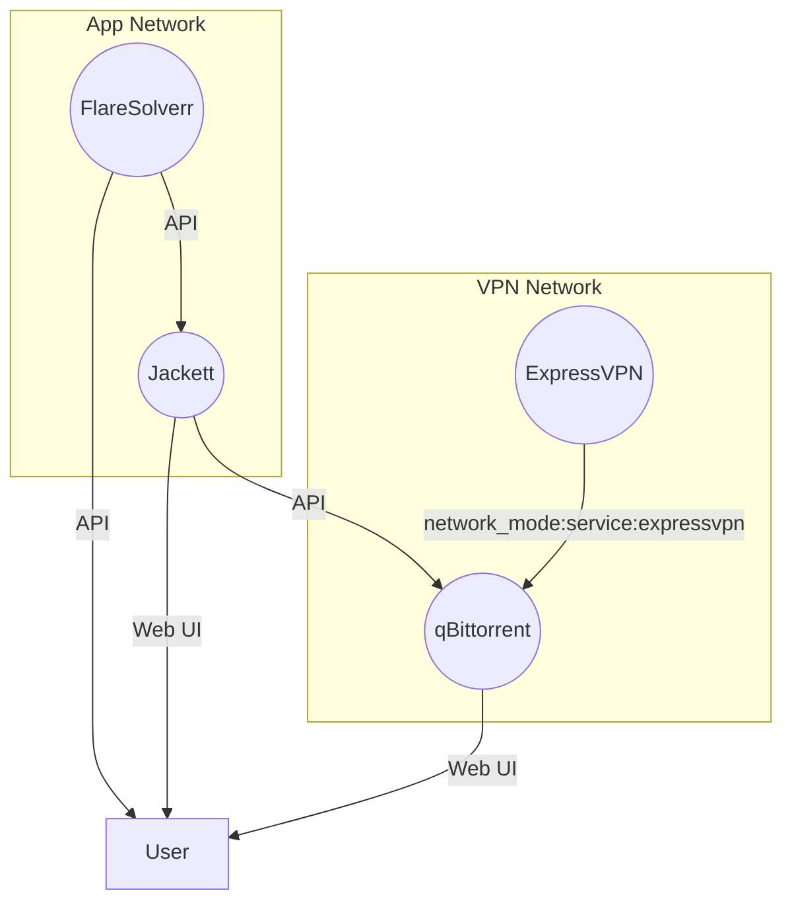

# Stack Architecture Diagram (Mermaid)

# Usage Examples

- See main README for command usage and setup.
- Run `pwsh ./scripts/validate-config.ps1` before starting the stack to check for missing/invalid configs.
- Use `pwsh ./scripts/cleanup-orphans.ps1` to remove old logs and orphaned Docker resources.
- Shared PowerShell path and `.env` resolution lives in `scripts/shared-functions.ps1`, so operational scripts follow the same host directory overrides.
- All scripts support robust logging and error handling.

# Troubleshooting

- If a service is unhealthy, run the corresponding healthcheck script in `scripts/` for details.
- For CI failures, check the uploaded `test-all-output.txt` artifact.

# Security

- Never commit `.env` or secrets to git.
- All scripts redact sensitive values in logs.
- Pre-commit and CI guardrails block secrets from being committed.
